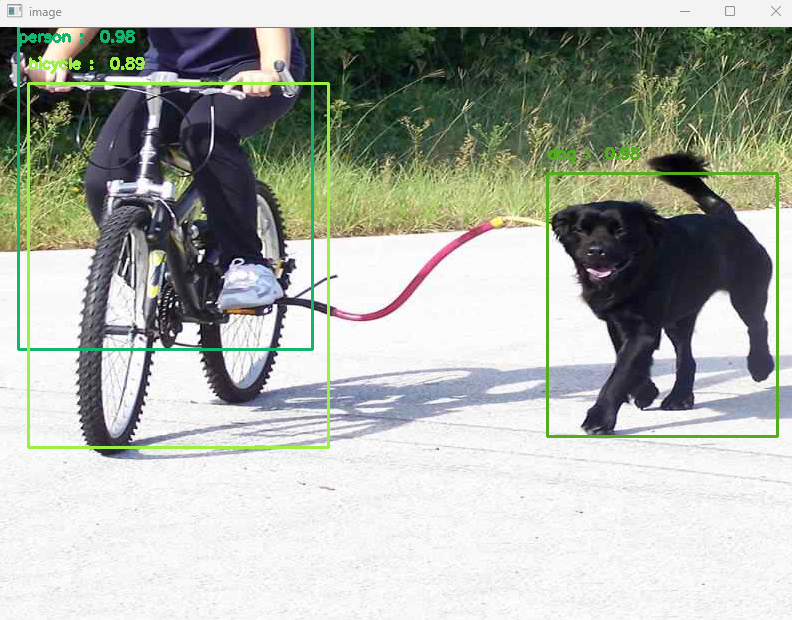
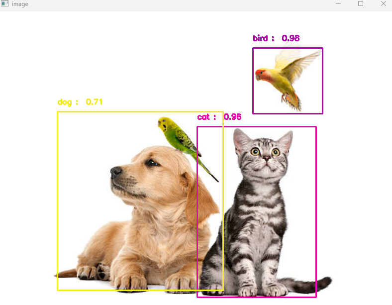
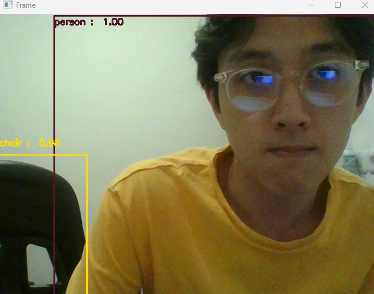

# MobileNetSSD Object Detection 🤖

(Note: This project was made in 2025, but I decided to upload it to GitHub in 2026 to keep it safe :D. )

Last time, I tried detecting faces. Now, I want to detect multiple things at once.

This project deepened understanding of the Single Shot Detector (SSD) architecture and multi-class detection.

## Overview

The program uses a MobileNet SSD model pre-trained on the COCO/VOC dataset to detect 20 object classes in images and video. Each detected object is labelled with its class name and confidence score. The detection runs on both static images and live webcam streams.

## Concepts Learned

- Single Shot Detector (SSD) architecture overview
- Difference between classification and detection
- Multi-class object detection with class label mapping
- Confidence thresholding to filter weak detections
- Bounding box coordinate normalization (0–1 range vs pixel values)
- Working with pre-trained model asset files

## Screenshots / Output






## Setup

```
pip install opencv-python numpy
```

Download the model files:
- `MobileNetSSD_deploy.prototxt`
- `MobileNetSSD_deploy.caffemodel`

